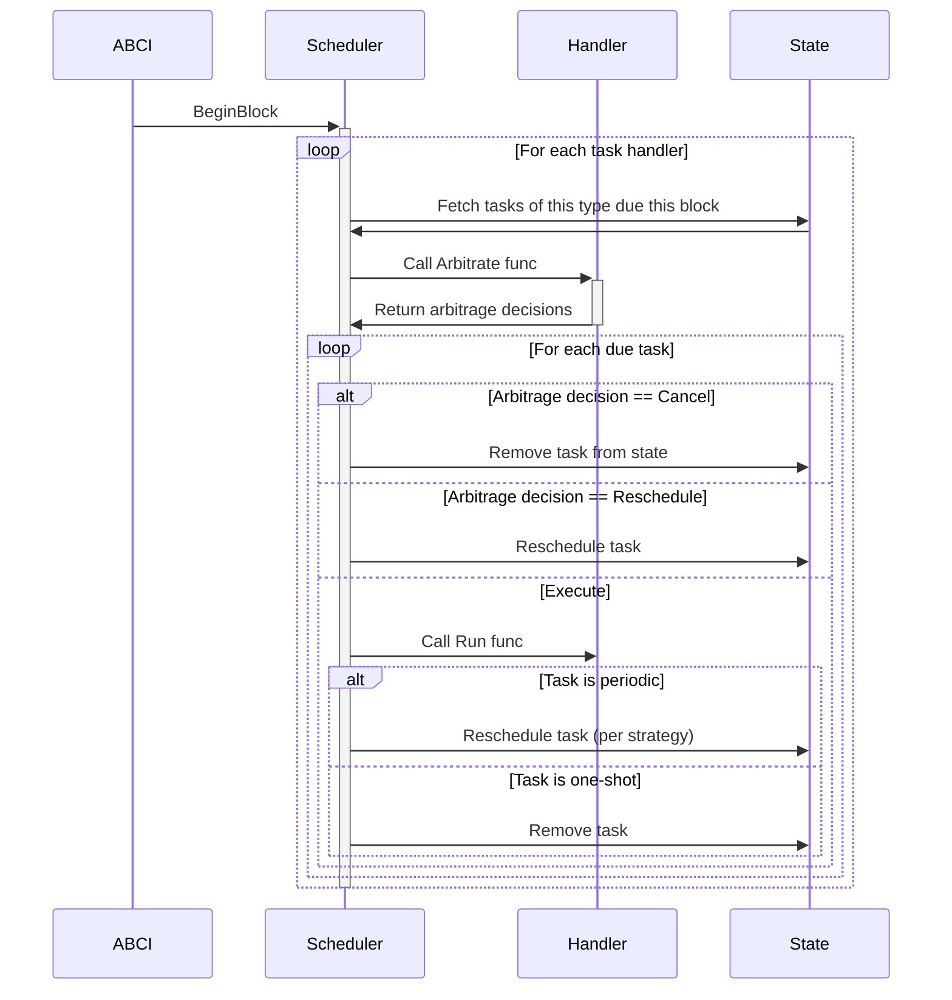

# Scheduler Module

The `x/scheduler` module allows other modules to schedule tasks for deferred execution at specific times. It handles 
task scheduling while delegating the actual execution logic to modules through registered task type handlers.
Tasks are automatically executed in an order compliant with potential dependencies between tasks, and modules can 
dynamically decide to execute, postpone, or reject their own tasks.

## Usage

This section aims to provide guidelines on how to leverage the `x/scheduler` module from another module.

### Registering a Task Handler

Each task is of a certain type, so the first step is to register a task handler to manage this task type.

Assuming we want to create a task type `my_task` in the `x/my_module` module, we would do the following:

**1. Create the task type arguments proto message (i.e. in any):**

Create in your proto API a `tasks.proto` file with the needed message definition, for example:
```proto
message MyTaskArgs {
  string input_1 = 1;
  string input_2 = 2;
}
```

**2. Add the task type name in `x/my_module/types/keys.go`:**

```go
const (
	ModuleName = "my_module"
    TaskMyTask = ModuleName + ":my_task"
)
```

**3. Implement the task handler in `x/my_module/keeper/tasks.go`:**

```go
func (k *Keeper) TaskHandlers() schedulertypes.TaskHandlers {
    return schedulertypes.TaskHandlers{
        schedulertypes.NewTaskHandler[*types.MyTaskArgs](
            types.TaskMyTask, // Task type name
            nil,              // Dependencies, if any
			func(ctx context.Context, tasks []schedulertypes.Invocation[*types.MyTaskArgs]) ([]schedulertypes.ArbitrageDecision, error) {
				return nil, nil // Arbitrage func
            },
            func(ctx context.Context, task schedulertypes.Task, args *types.MyTaskArgs) error {
                return nil // Run func
            },
        ),
    }
}
```

We can also implement a task handler with no arguments:
```go
schedulertypes.NewNoArgsTaskHandler(
    "noargs",
    nil,
    func(ctx context.Context, tasks []schedulertypes.TaskID) (map[schedulertypes.TaskID]schedulertypes.ArbitrageDecision, error) {
        return nil, nil
    },
    func(ctx context.Context, task schedulertypes.Task) error {
        return nil
    },
)
```

A task handler is defined by:
- **Name**: a unique identifier for the task type;
- **Argument type**: a type used to provide arguments to the task execution logic, which must implement `proto.Message`;
- **Dependencies**: a list of other task types that must be executed before this task type;
- **Arbitrage function**: a function called before task execution with the set of tasks that are due at this moment, and allow to take arbitrage decisions on whether to execute specific tasks or not;
- **Run function**: the actual logic to execute the task;

A word about the arbitrage and run functions: These are called in the context of a `BeginBlocker`, if an error is returned it'll halt the chain. 
Through the arbitrage step a decision can be made for a task, either to cancel it or to reschedule it.

**4. Register the task handler in `x/my_module/module/depinject.go`:**

Update the module outputs to indicate there are task handlers to register:
```go
type ModuleOutputs struct {
	depinject.Out

	Module    appmodule.AppModule
	Keeper    keeper.Keeper
	TaskHandlers schedulertypes.TaskHandlers
}
```

And register the task handlers in the `ProvideModule` function:
```go
func ProvideModule(in ModuleInputs) ModuleOutputs {
	k := keeper.NewKeeper(...)
	m := NewAppModule(...)

	return ModuleOutputs{Module: m, Keeper: k, TaskHandlers: k.TaskHandlers(), Out: depinject.Out{}}
}
```

### Scheduling a Task

A task can be created and scheduled using the `keeper.Keeper#Schedule` method:
```go
func (k *Keeper) ScheduleTask(ctx context.Context, typename string, id types.TaskID, args proto.Message, scheduleOpts ...types.SchedulingOption) error
```

Where:
- `typename`: the type of the task, which must point to a registered task handler;
- `id`: a string identifier that must be unique across the different task types;
- `args`: the arguments to be passed to the task execution logic, which must be of the type expected by the task handler;
- `scheduleOpts`: optional scheduling options, like the execution time and interval for periodic tasks;

For example, to schedule a one-shot task of type `my_task` to be executed at a specific time:
```go
err := schedulerKeeper.ScheduleTask(
    ctx,
    types.TaskMyTask, // Task type
    "task-id", // Unique task ID
    &types.MyTaskArgs{ // Task arguments
        Input1: "value1",
        Input2: "value2",
    },
    schedulertypes.ScheduleAt(at), // Schedule to run at specific time
)
```

In order to schedule a periodic task of type `my_task` to be executed every interval starting in some duration:
```go
err := schedulerKeeper.ScheduleTask(
    ctx,
    types.TaskMyTask,
    "task-id",
    &types.MyTaskArgs{
        Input1: "value1",
        Input2: "value2",
    },
    schedulertypes.ScheduleIn(in),
    schedulertypes.ScheduleEvery(interval),
)
```

**NOTE:** A task can be created but not scheduled if no scheduling option is provided or by using the `scheduletypes.Unschedule()` option.

An existing task can be rescheduled using the `keeper.Keeper#RescheduleTask` method:
```go
func (k *Keeper) RescheduleTask(ctx context.Context, id types.TaskID, scheduleOpts ...types.SchedulingOption) error
```

Where:
- `id`: the unique identifier of the task to be rescheduled;
- `scheduleOpts`: the new scheduling options, like the execution time and interval for periodic tasks;

For example, this can be use to postpone a task:
```go
err := schedulerKeeper.RescheduleTask(
    ctx,
    "task-id", // Unique task ID
    schedulertypes.ScheduleAt(newAt), // Reschedule to run at a new specific time
)
```

Or to pause & resume a periodic task:
```go
err := schedulerKeeper.RescheduleTask(
    ctx,
    "task-id", // Unique task ID
    schedulertypes.Unschedule(), // Pause the task
)
err := schedulerKeeper.RescheduleTask(
    ctx,
    "task-id", // Unique task ID
    schedulertypes.ScheduleAt(at), // Resume the task at
)
```

The possibility of keeping a task unscheduled can be useful to avoid losing task execution history metadata such as the execution counter and the last execution time.

## Details

This section aims to provide more in-depth information about the `x/scheduler` internals.

### Entities

There are two main entities in the `x/scheduler` module:

- **Task**: The execution unit that is scheduled for deferred execution.
- **TaskHandler**: The logic that defines how a task of a specific type is executed.

#### Task Handler

A `TaskHandler` (i.e., anything implementing `types.TaskHandler`) is attached to a specific task type and 
provides both the logic to execute the task and the task type specifications.

A task type is specified by:
- **Typename**: A unique identifier for the task type;
- **Dependencies**: A list of task types it depends on, defining execution order;
- **Arguments**: A type used to provide arguments to the task execution logic, which must implement `proto.Message`;

The attached execution logic is defined by:
- **Arbitrage function**: A function called before task invocation with the set of tasks that are due at this moment, and allow to take arbitrage decisions on whether to execute specific tasks or not;
- **Run function**: The actual logic to execute the task;

The `TaskHandlers` must be registered in the `x/scheduler` module (i.e., see the usage section above), when registering 
the handlers in `keeper.Keeper#RegisterTaskHandlers` the related DAG is computed to determine the task types execution order.
All the `TaskHandler` are then kept in-memory in the `keeper.Keeper`.

#### Task

A `Task` is defined by:
- **ID**: A string identifier that must be unique across the different task types;
- **Type**: The type of the task, which must point to the registered `TaskHandler` to be used;
- **Arguments**: The arguments to be passed to the task execution logic, which must implement `proto.Message`;

In the task scheduling, we'll identify two kinds of tasks:
- **One-shot task**: Tasks that are due for a single execution at the specified time;
- **Periodic task**: Tasks that are executed recurrently at each specified interval;

All tasks share the same underlying `types.Task` data structure, a periodic task is simply a task that has the interval field set.
This indicates that the task should be automatically rescheduled after each execution, based on the configured interval.
In other words, a periodic task is not a particular type of task, but rather a particular scheduling configuration of a task.

Internally, the `x/scheduler` module keeps tracks of executions with information like the execution counter and the last 
execution time.

### State

#### Stores

The keeper currently uses two stores to keep track of the tasks and their scheduling.

**1. The `tasks` store:**

The `tasks` store holds all the tasks mapped by their `TaskID`.

This store is an `IndexedMap` as it also contains an index on the tasks types, allowing to retrieve all the tasks of a 
specific type. This could have been achieved using two separate stores, but the `IndexedMap` allows to maintain both 
stores upon insertions and deletions.

**2. The `tasks_schedule`**

The `tasks_schedule` store holds information about tasks scheduling.

This store index tasks on both their scheduled execution time and their type, allowing to retrieve all the tasks of a 
certain type that are due for execution at a specific time. To do so the store key is a triple `<type, time, id>` which
allow the usage of triple prefixes and super prefixes to efficiently query the due tasks for a specific time and type.

The store is not part of the `tasks` store indexes, as we do need to manipulate it independently. For instance, in the 
case of pausing a periodic task, the task stays in the `tasks` store but is not scheduled anymore and thus removed from
the `tasks_schedule` store.

#### Task Arguments

In the [task.proto](./proto/scheduler/v1/task.proto) the arguments are defined as a protobuf `Any`.

The `x/scheduler` module has no information related to the concrete type of arguments, it only requires it to be an 
implementation of `proto.Message`.

When scheduling a task, the validation and serialization are delegated to the `TaskHandler` associated with the task 
type. And the same applies to deserialization when executing the task.

When using the `types.NewTaskHandler` helper to create handlers, serialization, deserialization and type validations 
are automatically managed.

### Execution flow

The execution logic of `x/scheduler` takes place in the `BeginBlocker`.

At each block it iterates over the registered task handlers in dependency order, and for each handler, it fetches the tasks that are due for execution at the current block time.

A task is considered due if its scheduled time is less than or equal to the current block time.

The execution flow for each task handler follows these steps:

- Call the `TaskHandler#Arbitrate` method of the handler with the fetched tasks to decide whether to execute, cancel, or reschedule each task.
- For each task approved for execution, call the `TaskHandler#Run` method to execute the task.
- Update the task metadata after execution, incrementing the `runCount` and setting the `lastRunAt` to the current block time.
- If the task is periodic, compute the next run time based on the configured interval and reschedule it.
- If the task is one-shot, remove it from the state.

If an error is returned at any point in the flow (from arbitration or execution), **the chain halts**.

The flow can be illustrated as follows:



About the `TaskHandler#Arbitrate` or `TaskHandler#Run` functions, the underlying logic may interact with the scheduler keeper
but with caution: it is discouraged to mutate the tasks being executed as changed won't be reflected, and removal can cause errors.

#### Periodic Tasks Scheduling

When a task is periodic (i.e., it has a non-empty `interval`), the next run time is computed using one of two strategies:

- **Relative**: from the current block time `block_time + interval`;
- **Absolute**: from the originally scheduled time `scheduled_time + (missed_run_count + 1) * interval`;
